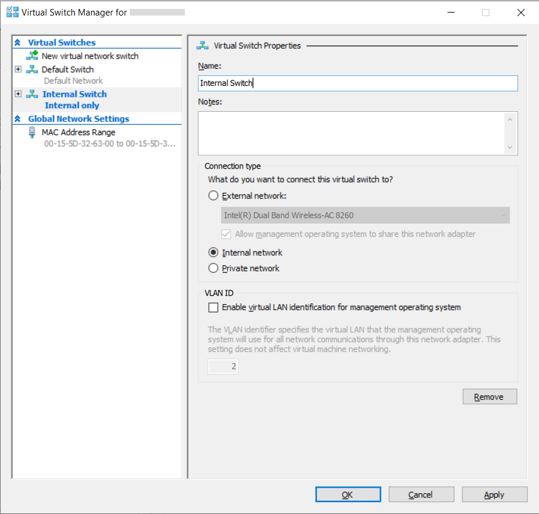
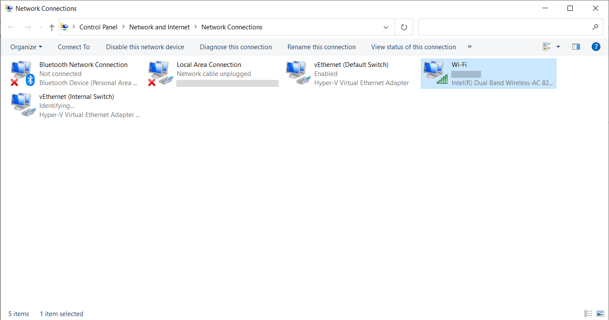
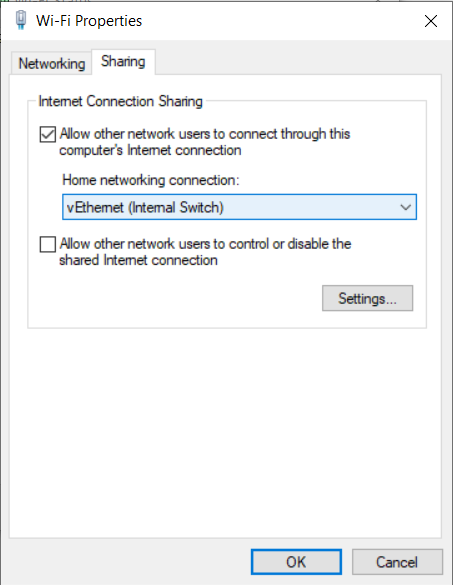
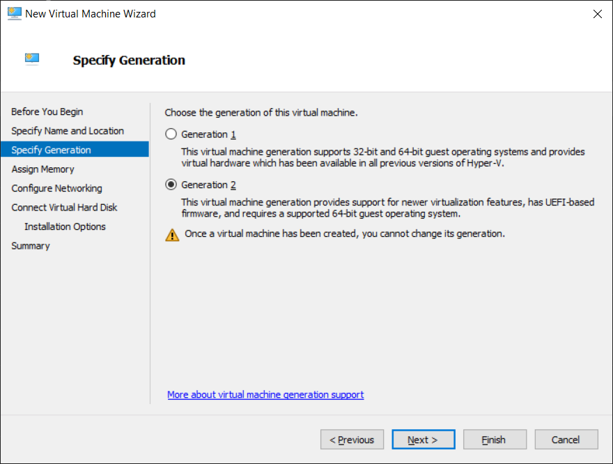
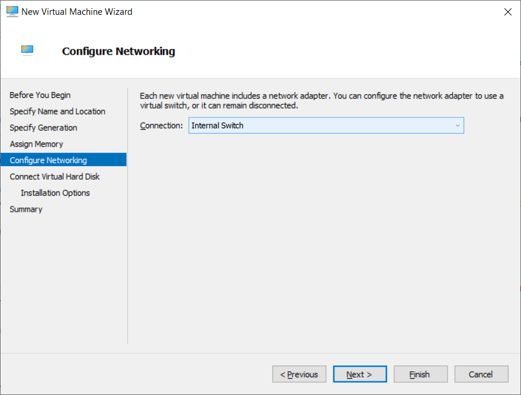
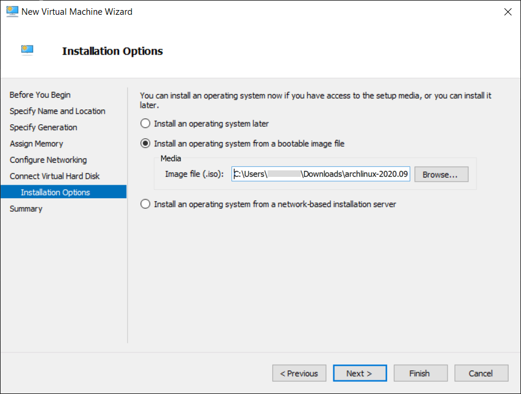
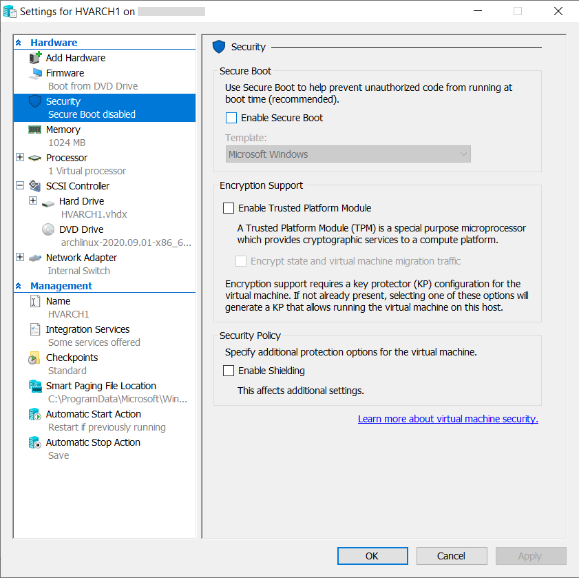
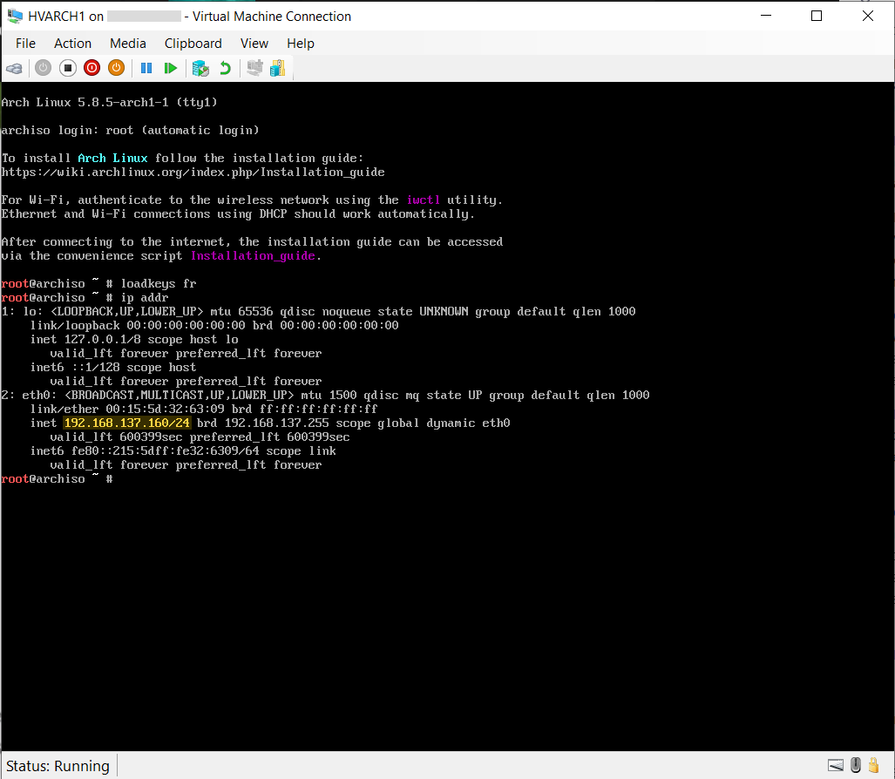
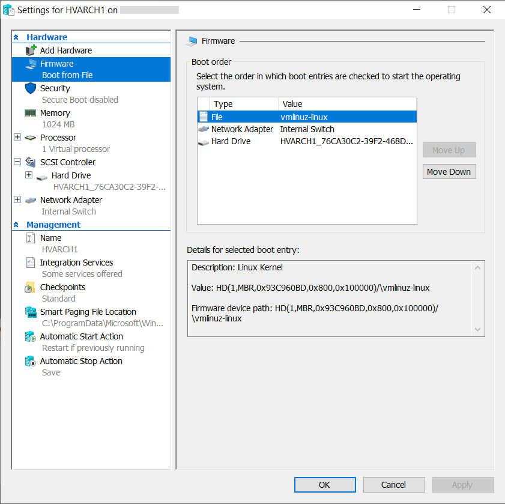

# Installing an Arch Linux virtual machine on Hyper-V

## 1. Creating the Internal Network Switch

If you need the VM to directly connect to your network, use an External Switch instead. An Internal Switch will create a
subnet inside the host computer that VMs can connect to. You can give these VMs access to the internet by using Windows
Internet Connection Sharing. 

To set up an Internal Switch with Internet Connection Sharing, go through the following steps:

- Inside the Hyper-V Manager (`virtmgmt.msc`), open the Virtual Switch Manager. Create and name your Internal Switch.



- Open the Network Connections Control Panel (`ncpa.cpl`). Select a network adapter that has internet access, that you
  would like to connect the Internal Switch to.



- Open the Sharing tab in the adapter's properties panel, check the "Allow other network users to connect through this
  computer's Internet connection" box. Select the Internal Switch as the "Home networking connection."



## 2. Creating the virtual vachine in Hyper-V Manager

Open the Hyper-V Manager (`virtmgmt.msc`), and select New > Virtual Machine... to open the New Virtual Machine Wizard.
Go through the wizard as you normally would but take note of the following settings:

- When specifying the Hyper-V Generation, use Generation 2 to create a UEFI virtual machine.



- Select the Internal Switch you created when configuring networking.



- Select "Install an operating system from a bootable image file" and set it to your Arch Linux installation image.



## 3. Disable Secure Boot in the VM settings

Secure Boot requires that the bootloader be signed with Microsoft's key. In order to boot into the Arch Linux
installation image you need to disable Secure Boot. In your virtual machine's settings go to the Security tab and
uncheck "Enable Secure Boot"



## 4. Setting up SSH on the installation image

It is easier to interact with the installation image via SSH. To do so, go through the following steps:

- After having started the virtual machine, set your keyboard layout using `loadkeys`.
```
# loadkeys fr
```

- Note down the DHCP-assigned IP address of the virtual machine.
```
# ip addr
```



- Set the password of the root user so that you can connect to it via SSH.
```
# passwd
```

- Then start the SSH server.

```
# systemctl start sshd.service
```

Now you can connect to the installation image using the `root` account.

## 5. Install Arch Linux on the virtual machine

The next steps in order to install are well detailed in the wiki's [installation
guide](https://wiki.archlinux.org/index.php/Installation_guide). You should  follow those instructions but here are some
steps that are specific to our virtual machine:

### Partitioning the disks

Since we are using UEFI, you must create an EFI system partition for the BIOS to find the bootloader in. 

<pre><code># fdisk /dev/sda

Welcome to fdisk (util-linux 2.36).
Changes will remain in memory only, until you decide to write them.
Be careful before using the write command.

Device does not contain a recognized partition table.
Created a new DOS disklabel with disk identifier 0x93c960bd.

Command (m for help): <b>n</b>
Partition type
   p   primary (0 primary, 0 extended, 4 free)
   e   extended (container for logical partitions)
Select (default p): <b>&crarr;</b>

Using default response p.
Partition number (1-4, default 1): <b>&crarr;</b>
First sector (2048-266338303, default 2048): <b>&crarr;</b>
Last sector, +/-sectors or +/-size{K,M,G,T,P} (2048-266338303, default 266338303): <b>+512M</b>

Created a new partition 1 of type 'Linux' and of size 512 MiB.

Command (m for help): <b>n</b>
Partition type
   p   primary (1 primary, 0 extended, 3 free)
   e   extended (container for logical partitions)
Select (default p): <b>&crarr;</b>

Using default response p.
Partition number (2-4, default 2): <b>&crarr;</b>
First sector (1050624-266338303, default 1050624): <b>&crarr;</b>
Last sector, +/-sectors or +/-size{K,M,G,T,P} (1050624-266338303, default 266338303): <b>&crarr;</b>

Created a new partition 2 of type 'Linux' and of size 126.5 GiB.

Command (m for help): <b>w</b>
The partition table has been altered.
Calling ioctl() to re-read partition table.
Syncing disks.</code></pre>

### Format the partitions and mount them

In this case we are using FAT for the EFI System Partition and ext4 for the root partition.

```
# mkfs.fat /dev/sda1
# mkfs.ext4 /dev/sda2
```
The EFI System Partition is generally mounted at `/boot` on the root partition. 

```
# mount /dev/sda2 /mnt
# mkdir /mnt/boot
# mount /dev/sda1 /mnt/boot
```

### Installing the system and essential packages

Use `pacstrap` to install the `base` package, along with the Linux kernel, the DHCP client, SSH and `nano`.

```
# pacstrap /mnt base linux dhcpcd openssh nano
```

### Configure the system

- Generate an `fstab` file:
```
# genfstab -U /mnt >> /mnt/etc/fstab
```

- Change root into the new system:
```
# arch-chroot /mnt
```

- Set the timezone:
```
# ln -sf /usr/share/zoneinfo/Europe/Paris /etc/localtime
```

- Edit `/etc/locale.gen` and uncomment `en_US.UTF-8 UTF-8`, then run `locale-gen`:
```
# nano /etc/locale.gen
# locale-gen
```

- Set the framebuffer keyboard layout:
<pre><code># nano /etc/vconsole.conf
<b>KEYMAP=fr</b></code></pre>

- Set the hostname and add entries to the hosts file.
  
<pre><code># nano /etc/hostname
<b>HVARCH1</b>
# nano /etc/hosts
<b>127.0.0.1	localhost
::1		localhost</b></code></pre>

- Set the root password:
```
# passwd
```

- Enable the DHCP client service:
```
# systemctl enable dhcpcd
```

## 6. Setting up the EFISTUB bootloader

The Linux kernel supports booting off of EFI directly without the need for a bootloader when it is configured with
`CONFIG_EFI_STUB` support. The kernel parameters are stored in the EFI parameters in the BIOS and passed on to the EFI
stub in the kernel on startup.

- Exit out of the `chroot` using `exit` or Ctrl + D.

- First find the partition UUID of the root partition by using `blkid`:
```
# blkid /dev/sda2
```
- Use `efibootmgr` to create an EFI entry for the Linux kernel, and use the PARTUUID from the root partition.
<pre><code># efibootmgr --disk /dev/sda --part 1 --create --label "Linux Kernel" --loader /vmlinuz-linux --verbose \
    --unicode 'root=PARTUUID=<b>XXXXXXXX-XX</b> rw initrd=\initramfs-linux.img' 
</code></pre>

- Poweroff the installation image cleanly:
```
# poweroff
```

- In the virtual machine settings, remove the installation image from the SCSI Controller.

Arch Linux is now installed on the virtual machine. You should be able to see the `vmlinuz-linux` kernel file in the
Firmware tab.



## 7. Assigning a static IP address and adding it to Windows HOSTS
